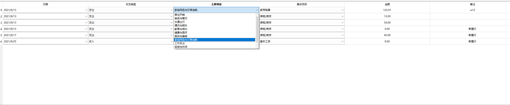
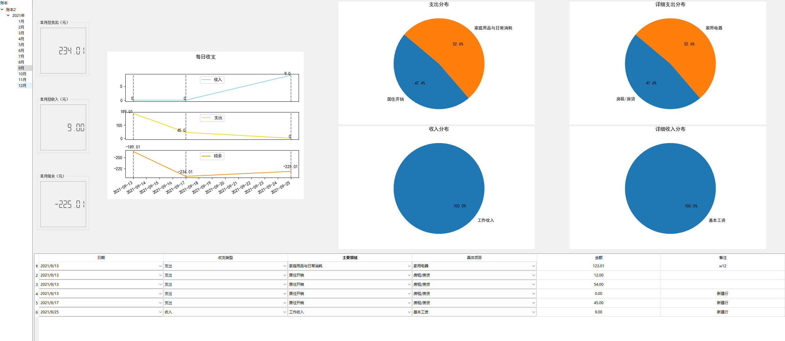

# Account Your Life

## _Account a better life once you are ready to embrace it!_

### 作者与日期
- 作者： WFF
- 撰写日期：2024-11-12

---

## 目录
- [1.功能介绍 ](#1-功能介绍)
- [2. 生成可执行程序](#2-生成可执行程序)
---
## 1. 功能介绍
### 1.1 拥有多样的多级条目
本产品提供了详细的账本条目，从收入支出到主要收支领域再到细分的具体收支项目，可以较为全面的你日常生活中所出现的各种收入与支出情形。   
记账条目包括日期、收支类型、主要领域、具体项目、金额和备注

### 1.2 按月进行统计更方便用户使用
本产品按月进行统计，每个月使用独立的一页账目进行记录，并且可以实时显示当月的总收入总支出总结余，以及当月收支的趋势和消费内容


## 2. 生成可执行程序
```bash
pyinstaller AccountYourLife.spec
```
# HouseholdAccountBook
# HouseholdAccountBook
# HouseholdAccountBook
